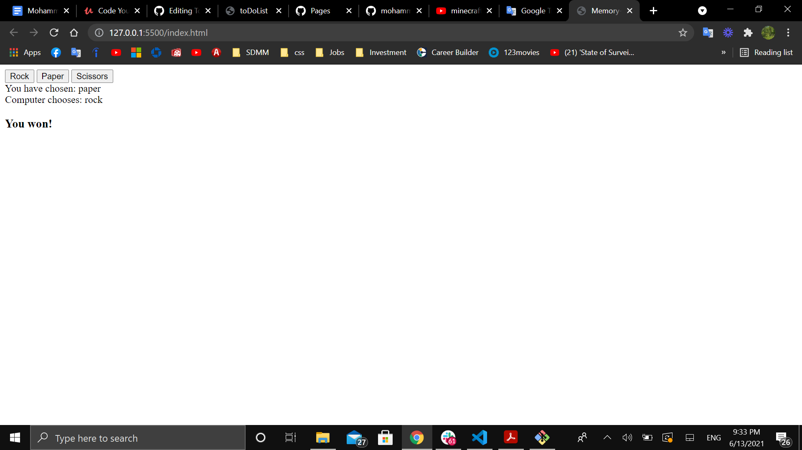

# Vanilla JavaScript rock-paper-scissors 

#### A simple Rock-Paper-Scissors game written entirely in Javascript, HTML, and CSS.

#### Play it [here](https://mohammedq91.github.io/rock-paper-scissors/)

## Summary

This project highlighted the significane of minimizing global variables utility and of using local variables inside functions, instead. I learned how to access the DOM and loop through one element at a time and add Event Listener to it. I learned how to declare a fucntion to use to perform one task only, to recall the function, passing through needed variables/constants to other functions through their argument/parameters. I also learned how to use template literals and implement variables to them to have dynamic displays. Finally, I was introduced to switch statement.

## Author

- **Mohammed Qaralos** - *Self taught Software Developer* - [Website](http://127.0.0.1:5500/index.html) | [LinkedIn](https://www.linkedin.com/in/mohammed-qaralos-27151010a/)
